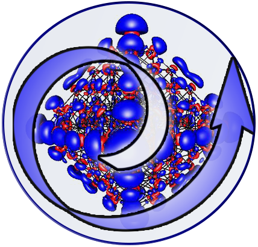

When publishing results obtained with DFT-VASP WaNo, please consider to cite: 

# SIMONA-DHscan


This WaNo:

1. Generates a molecule with SMILE code or uses coordinates with PDB format.
2. Perform a scan screening calculation of all possible dihedrals using SIMONA.
3. Obtain coordinates for the best scored dihedral and the atom identity of the torsion.

## 1. Software Setup

To get this workflow up running on your available computational resources, make sure to have the below libraries installed on Python 3.6 or newer.

```
1. AmberTools and AcPype.
2. Gromacs.
3. Pymol (API).
4. Turbomole.
5. SIMONA
6. glob, tarfile, numpy, matplotlib, pandas.  
```
### SIMONA set up

This WaNo uses SIMONA with a local compilation, please add the SIMONA path in "settings.sh" file as follow:

```
#CUSTOM SIMONA PATHS
#CUSTOMSIMONAPYTHONPATH = "PATH_TO_SIMONA/python"
#CUSTOMSIMONAPOEMPPPATH = "PATH_TO_SIMONA/bin"
```

## 2. Inputs

To perform all the scan calculations the following settings are mandatory:
- Molecule Name
- Molecule net charge
- Rotation steps

a) SIMONA dihedral scan:

SIMONA dihedral scan can be performed with two kind of input: (1) SMILE code or (2)  PDB coordinates. In case you prefer to use PDB coordinates, check and clean your structure and provide sensible atom names.

First choose "Dihedral Score to identify dihedrals (SIMONA)", and then Smile code or Coordinates, respectively.


b) DFT-Turbomole coordinates generator

In case the user has the preference to perform a dihedral scan calculation with a given molecule and a specific torsion, first select "Generate structure inputs for DFT-Turbomole" and then provide:

- Coordinates file
- Atom ids of the selected torsion


References:

1. Strunk, T., Wolf, M., Brieg, M., Klenin, K., Biewer, A., Tristram, F., ... & Wenzel, W. (2012). SIMONA 1.0: An efficient and versatile framework for stochastic simulations of molecular and nanoscale systems. Journal of computational chemistry, 33(32), 2602-2613.

2. D.A. Case, H.M. Aktulga, K. Belfon, I.Y. Ben-Shalom, S.R. Brozell, D.S. Cerutti, T.E. Cheatham, III, G.A. Cisneros, V.W.D. Cruzeiro, T.A. Darden, R.E. Duke, G. Giambasu, M.K. Gilson, H. Gohlke, A.W. Goetz, R. Harris, S. Izadi, S.A. Izmailov, C. Jin, K. Kasavajhala, M.C. Kaymak, E. King, A. Kovalenko, T. Kurtzman, T.S. Lee, S. LeGrand, P. Li, C. Lin, J. Liu, T. Luchko, R. Luo, M. Machado, V. Man, M. Manathunga, K.M. Merz, Y. Miao, O. Mikhailovskii, G. Monard, H. Nguyen, K.A. O’Hearn, A. Onufriev, F. Pan, S. Pantano, R. Qi, A. Rahnamoun, D.R. Roe, A. Roitberg, C. Sagui, S. Schott-Verdugo, J. Shen, C.L. Simmerling, N.R. Skrynnikov, J. Smith, J. Swails, R.C. Walker, J. Wang, H. Wei, R.M. Wolf, X. Wu, Y. Xue, D.M. York, S. Zhao, and P.A. Kollman (2021), Amber 2021, University of California, San Francisco.

3. Sousa da Silva, A. W., & Vranken, W. F. (2012). ACPYPE-Antechamber python parser interface. BMC research notes, 5(1), 1-8.

4. Van Der Spoel, D., Lindahl, E., Hess, B., Groenhof, G., Mark, A. E., & Berendsen, H. J. (2005). GROMACS: fast, flexible, and free. Journal of computational chemistry, 26(16), 1701-1718.

5. Schrödinger, L., & DeLano, W. (2020). PyMOL. Retrieved from http://www.pymol.org/pymol
